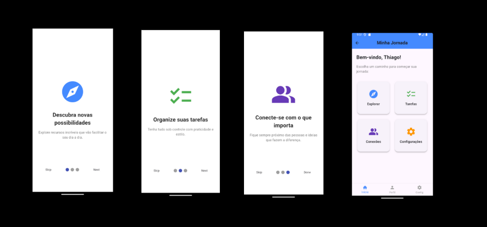

# Minha Jornada

A ideia desse projeto é ser um caso de estudo sobre telas de introdução em Flutter, explorando as funcionalidades do **PageView**, o pacote **smooth_page_indicator** e praticar conceitos de navegação e design. 

O app conta com **3 páginas de introdução** (Onboarding) e uma **HomePage personalizada ilustrativa**, com atalhos para as principais funcionalidades. 

---

## 📸 Preview



---

## Funcionalidades

* **Onboarding com PageView**

  * Página 1: *Descubra novas possibilidades*
  * Página 2: *Organize suas tarefas*
  * Página 3: *Conecte-se com o que importa*

* **HomePage**

  * AppBar com título.
  * Mensagem de boas-vindas.
  * Grid de atalhos interativos (Explorar, Tarefas, Conexões, Configurações).
  * BottomNavigationBar para navegação.

---

## Tecnologias Utilizadas

* [Flutter](https://flutter.dev/)
* [Dart](https://dart.dev/)
* Widgets principais:

  * `PageView`
  * `StatelessWidget` / `Scaffold`
  * `GridView`
  * `BottomNavigationBar`

---

## Estrutura do Projeto

```
lib/
 ├── main.dart
 ├── intro_pages/
 │    ├── intro_page1.dart
 │    ├── intro_page2.dart
 │    └── intro_page3.dart
 ├── onboarding_screen.dart
 └── home_page.dart
```

---

## ▶️ Como Executar

1. Clone este repositório:
2. Acesse a pasta do projeto:
3. Instale as dependências:

   ```bash
   flutter pub get
   ```
4. Execute o app:

   ```bash
   flutter run
   ```

---

## 🎨 Paleta de Cores

* Azul primário: `#1976D2`
* Azul claro: `#64B5F6`
* Branco: `#FFFFFF`
* Cinza suave: `#F5F5F5`

---

## Licença

Este projeto é apenas para fins de estudo e aprendizado.
Sinta-se à vontade para modificar e expandir!
